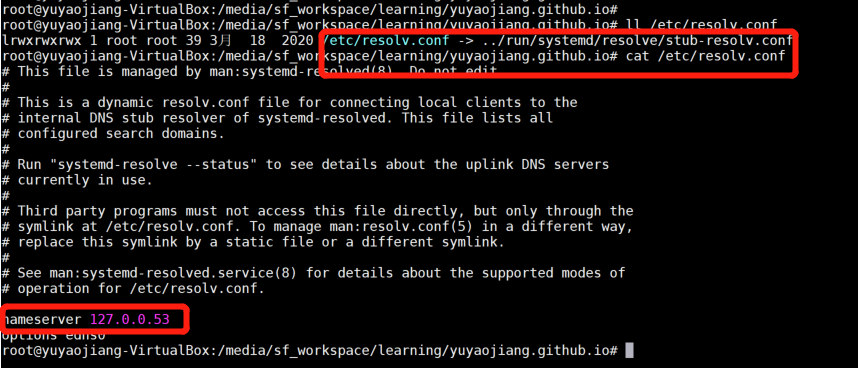

# 主机DNS流程：

DNS的目的：根据域名查找对应的IP地址

## 1、检查浏览器中是否缓存该域名对应的IP地址

用户通过浏览器浏览过某网站之后，浏览器就会自动缓存该网站域名对应的地址，当用户再次访问的时候，浏览器就会从缓存中查找该域名对应的IP地址，因为缓存不仅是有大小限制，而且还有时间限制（域名被缓存的时间通过属性来设置），所以存在域名对应的找不到的情况。当浏览器从缓存中找到了该网站域名对应的地址，那么整个解析过程结束，如果没有找到，将进行下一步骤。对于的缓存时间问题，不宜设置太长的缓存时间，时间太长，如果域名对应的发生变化，那么用户将在一段时间内无法正常访问到网站，如果太短，那么又造成频繁解析域名。

## 2、如果在浏览器缓存中没有找到IP，那么将继续查找本机系统是否缓存过IP

如果第一个步骤没有完成对域名的解析过程，那么浏览器会去系统缓存中查找系统是否缓存过这个域名对应的地址，也可以理解为系统自己也具备域名解析的基本能力。在系统中，可以通过设置文件来将域名手动绑定到某上，文件位置在。对于普通用户，并不推荐自己手动绑定域名和，对于开发者来说，通过绑定域名和，可以轻松切换环境，可以从测试环境切换到开发环境，方便开发和测试。在系统中，黑客常常修改他的电脑的文件，将用户常常访问的域名绑定到他指定的上，从而实现了本地解析，导致这些域名被劫持。在或者系统中，文件在，修改该文件也可以实现同样的目的。

本地缓存改动：windows系统C:\Windows\System32\drivers\etc\hosts文件，linux系统/etc/hosts文件

linux下的/etc/resolv.conf保存的是本地域名服务器的IP地址

Ubuntu系统通过读取/etc/resolv.conf中的DNS地址进行查询，默认DNS服务器IP是127.0.0.53

## 3、向本地域名解析服务系统发起域名解析的请求

如果在本机上无法完成域名的解析，那么系统只能请求本地域名解析服务系统进行解析，本地域名系统一般都是本地区的域名服务器，比如你连接的校园网，那么域名解析系统就在你的校园机房里，如果你连接的是电信、移动或者联通的网络，那么本地域名解析服务器就在本地区，由各自的运营商来提供服务。对于本地服务器地址，系统使用命令就可以查看，在和系统下，直接使用命令来查看服务地址。一般都缓存了大部分的域名解析的结果，当然缓存时间也受域名失效时间控制，大部分的解析工作到这里就差不多已经结束了，负责了大部分的解析工作。

## 4、向根域名解析服务器发起域名解析请求

本地域名解析器还没有完成解析的话，那么本地域名解析服务器将向根域名服务器发起解析请求(说明本地的域名服务器需要保存根域名服务器的IP地址)

## 5、根域名服务器返回gTLD域名解析服务器地址

## 6、向gTLD服务器发起解析请求

## 7、gTLD服务器接收请求并返回Name Server服务器

## 8、向Name Server服务器发起解析请求

## 9、Name Server服务器返回IP地址给本地服务器

## 10、 本地域名服务器缓存解析结果

## 11、返回解析结果给用户

解析结果将直接返回给用户，用户系统将缓存该地址，缓存时间由来控制，至此，解析过程结束。

