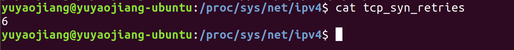
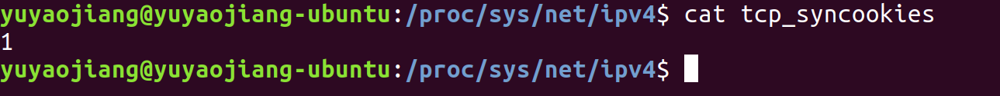
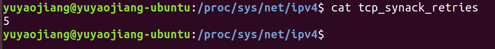
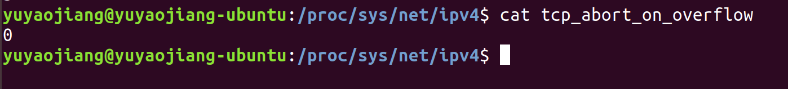

# TCP性能优化

linux 内核提供了方法来调节TCP的参数，如果想**永久的保存**参数的设置，可以将**参数加入到/etc/sysctl.conf**中。
如果想**临时的更改**参数的配置，可以**修改/proc/sys/net/ipv4/**下的参数，机器重启后更改失效。

我们先来整理一下/proc/sys/net/ipv4/目录下和TCP相关的参数：

| 名称 | 默认值（基于ubuntu18.04版本    ） | 描述 |
| :--- | :--- | :--- |
| tcp_syn_retries | 6 | 对于一个新建连接，内核要发送多少个 SYN 连接请求才决定放弃。不应该大于255，默认值6，第一次超时重传是在 1 秒后，第二次时重传是在 2 秒，第三次超时重传是在 4 秒后，第四次超时重传是在 8 秒后，第五次是在超时重传 16 秒后。每次超时的时间是上一次的 2 倍，对应于63秒左右时间 |
| tcp_synack_retries | 5 | 对于远端的连接请求SYN，内核会发送SYN ＋ ACK数据报，以确认收到上一个 SYN连接请求包。这是所谓的三次握手( threeway handshake)机制的第二个步骤。这里决定内核在放弃连接之前所送出的 SYN+ACK 数目。不应该大于255，默认值是5，对应于31秒左右时间。|
| tcp_keepalive_time | 7200 | TCP发送keepalive探测消息的间隔时间（秒），用于确认TCP连接是否有效，多长时间没有报文开始发送心跳包。|
| tcp_keepalive_probes | 9 | TCP发送keepalive探测消息的间隔时间（秒）|
| tcp_keepalive_intvl | 75 | 探测消息未获得响应时，重发该消息的间隔时间（秒）|
| tcp_retries1 | 3 | 放弃回应一个TCP连接请求前﹐需要进行多少次重试。RFC 规定最低的数值是3 |
| tcp_retries2 | 15 | 在丢弃激活(已建立通讯状况)的TCP连接之前﹐需要进行多少次重试。默认值为15，根据RTO的值来决定，相当于13-30分钟 |
| tcp_orphan_retries | 0 | TCP连接关闭时，主动方发送 FIN 报文后，连接就处于 FIN_WAIT1 状态，正常情况下，如果能及时收到被动方的 ACK，则会很快变为 FIN_WAIT2 状态。但是当迟迟收不到对方返回的 ACK 时，连接就会一直处于 FIN_WAIT1 状态。此时，内核会定时重发 FIN 报文，其中重发次数由tcp_orphan_retries 参数控制，默认值是 0，实际上当为 0 时，特指 8 次 |
| tcp_fin_timeout | 60 | TCP连接关闭时，当主动方收到 ACK 报文后，会处于 FIN_WAIT2 状态，就表示主动方的发送通道已经关闭，接下来将等待对方发送 FIN 报文，关闭对方的发送通道，如果连接是用 shutdown 函数关闭的，连接可以一直处于 FIN_WAIT2 状态，因为它可能还可以发送或接收数据。但对于 close 函数关闭的孤儿连接，由于无法再发送和接收数据，所以这个状态不可以持续太久，而 tcp_fin_timeout 控制了这个状态下连接的持续时长，默认值是 60 秒 | 
| tcp_max_tw_buckets | 8192 | TCP连接关闭时，当主动方接受对方的FIN报文后，发送ACK给对方，主动方便处于TIME_WAIT状态，TIME_WAIT 和 FIN_WAIT2状态的最大时长都是 2 MSL，由于在 Linux 系统中，MSL 的值固定为 30 秒，所以它们都是 60 秒，如果发起连接一方的 TIME_WAIT 状态过多，占满了所有端口资源，则会导致无法创建新连接，Linux 提供了 tcp_max_tw_buckets 参数，当 TIME_WAIT 的连接数量超过该参数时，新关闭的连接就不再经历 TIME_WAIT 而直接关闭 |
| tcp_tw_recycle |

## TCP三次握手期间性能优化

TCP三次握手的状态变迁图，参看[TCP三次握手状态机](./TCP-state-machine)

### 客户端的优化

客户端作为主动发起连接方，首先它将发送 **SYN** 包，于是客户端的连接就会处于 **SYN_SENT** 状态，客户端在等待服务端回复的 **ACK** 报文，正常情况下，服务器会在几毫秒内返回 **SYN+ACK** ，但如果客户端长时间没有收到 SYN+ACK 报文，则会重发 SYN 包，重发的次数由 **tcp_syn_retries** 参数控制，默认是 **6** 次：



通常，第一次超时重传是在 1 秒后，第二次超时重传是在 2 秒，第三次超时重传是在 4 秒后，第四次超时重传是在 8 秒后，第五次是在超时重传 16 秒后，第6次在 32 秒之后，当第6次超时重传后，会继续等待 64 秒，如果服务端仍然没有回应 ACK，客户端就会终止三次握手。

所以，总耗时是 1+2+4+8+16+32+64=127 秒，大约 2 分钟左右。没错，每次超时的时间是上一次的 2 倍

可以根据网络的稳定性和目标服务器的繁忙程度修改 SYN 的重传次数，调整客户端的三次握手时间上限。比如内网中通讯时，就可以适当调低重试次数，尽快把错误暴露给应用程序。

### 服务端优化

当服务端收到 **SYN** 包后，服务端会立马回复 **SYN+ACK** 包，表明确认收到了客户端的序列号，同时也把自己的序列号发给对方。

此时，服务端出现了新连接，状态是 **SYN_RCV**。在这个状态下，Linux 内核就会建立一个「**半连接队列**」来维护「未完成」的握手信息，当半连接队列溢出后，服务端就无法再建立新的连接。


**SYN Flood 攻击**，攻击的是就是这个半连接队列，如果半连接队列已满，服务端再收到SYN报文，则进行丢弃，或者开启 **syncookies** 功能就可以在不使用 SYN 半连接队列的情况下成功建立连接

如何查看是否丢弃了SYN报文：```netstat -s | grep "SYNs to LISTEN" ```

#### 如何调整半连接队列的大小：

要想增大半连接队列，不能只单纯增大 **tcp_max_syn_backlog** 的值，还需一同增大 **somaxconn** 和 **backlog**，也就是增大 accept 队列。

开启 **syncookies** 功能，**syncookies** 参数主要有以下三个值：

+ 0 值，表示关闭该功能；
+ 1 值，表示仅当 SYN 半连接队列放不下时，再启用它；
+ 2 值，表示无条件开启功能；

那么在应对 SYN 攻击时，只需要设置为 1 即可，**tcp_syncookies的默认值为1**



当客户端接收到服务器发来的 **SYN+ACK** 报文后，就会回复 ACK 给服务器，同时客户端连接状态从 SYN_SENT 转换为 ESTABLISHED，表示连接建立成功。

服务器端连接成功建立的时间还要再往后，等到服务端收到客户端的 ACK 后，服务端的连接状态才变为 ESTABLISHED。

如果服务器没有收到 ACK，就会重发 SYN+ACK 报文，同时一直处于 SYN_RCV 状态。

当网络繁忙、不稳定时，报文丢失就会变严重，此时应该调大重发次数。反之则可以调小重发次数。修改重发次数的方法是，调整 **tcp_synack_retries** 参数

tcp_synack_retries 的默认重试次数是 5 次，与客户端重传 SYN 类似，它的重传会经历 1、2、4、8、16 秒，最后一次重传后会继续等待 32 秒，如果服务端仍然没有收到 ACK，才会关闭连接，故共需要等待 63 秒。



**服务器收到 ACK 后连接建立成功，此时，内核会把连接从半连接队列移除，然后创建新的完全的连接，并将其添加到 accept 队列(全连接队列)**，等待进程调用 accept 函数时把连接取出来。

**如果进程不能及时地调用 accept 函数，就会造成 accept 队列（也称全连接队列）溢出**，最终导致建立好的 TCP 连接被丢弃。


全连接队列满时，丢弃连接只是 Linux 的默认行为，我们还可以选择向客户端发送 RST 复位报文，告诉客户端连接已经建立失败。打开这一功能需要将 **tcp_abort_on_overflow** 参数设置为 1。

**tcp_abort_on_overflow** 共有两个值分别是 0 和 1，默认值为0：



其分别表示：

+ 0 ：如果 accept 队列满了，那么 server 扔掉 client 发过来的 ack ；
+ 1 ：如果 accept 队列满了，server 发送一个 RST 包给 client，表示废掉这个握手过程和这个连接；


##