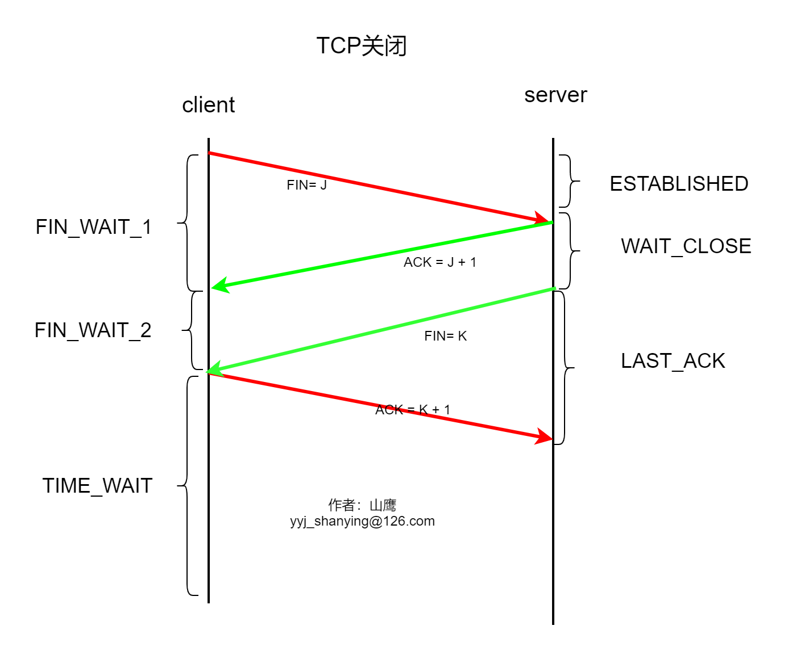
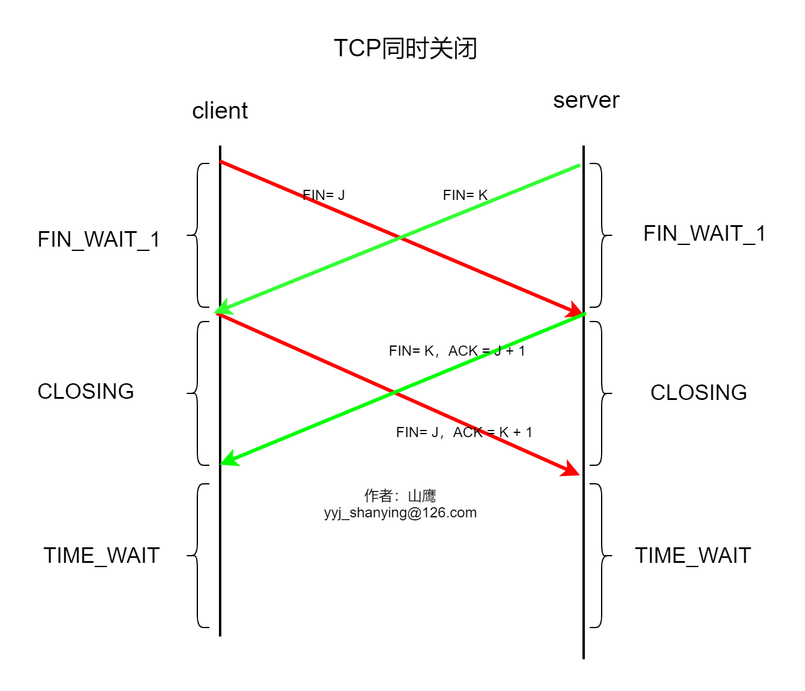

# TCP状态机

## 状态机总图

### TCP状态描述
    + CLOSED：表示初始状态
    + LISTENING：表示服务端处于监听状态
    + SYN_SEND：表示TCP打开时，首先发送SYN报文的一端，进入该状态
    + SYN_RECV：监听状态下，接受到SYNC报文，进入该状态
    + ESTABLISHED：建联成功，进入该状态
    + FIN_WAIT_1：TCP关闭时，首先发送FIN报文的一段，进入该状态
    + CLOSE_WAIT：建联状态下，收到对端FIN报文，进入该状态
    + FIN_WAIT_2: 处于FIN_WAIT_1状态下，接收到对端对FIN的ACK报文后，进入到该状态
    + LASK_ACK：CLOSE_WAIT状态下，应用程序调用close()接口，向对端发送FIN报文后，进入该状态
    + TIME_WAIT：FIN_WAIT_2状态下，接收到对端的FIN报文，向对端发送ACK报文后，进入该状态
    + CLOSING：处于FIN_WAIT_1状态下，接收到对端的FIN报文，进入该状态（同时关闭情形下的一个状态）

## TCP打开(服务端监听，客户端主动打开)

## 同时打开

## TCP关闭

## TCP同时关闭

