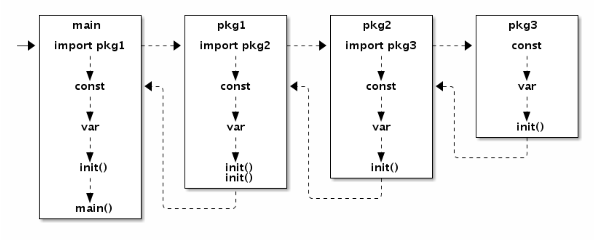

# 初始化流程

go函数的启动流程为：

以一个具体的例子来说明 main包中导入了package1，package1依赖于pacakge2，package2依赖于package3

则启动流程为：

1、初始化package3的常量和变量，调用package3的init函数；

2、初始化package2的常量和变量，调用package2的init函数；

3、初始化package1的常量和变量，调用package1的init函数；

4、初始化main包的常量和变量，调用main包的init函数；

5、执行main.main

注意事项：

1、如果一个包有多个init函数的话，调用顺序未定义；同一个文件内的多个init则是以出现的顺序依次调用（init不是普通函数，可以定义有多个，所以也不能被其它函数调用）

2、在main.main函数执行之前，所有的代码都执行在同一个goroutine中，如果某个init函数在内部使用了go关键字启动了一个新的goroutine，新的goroutine只有在main.main函数进入之后才会执行

