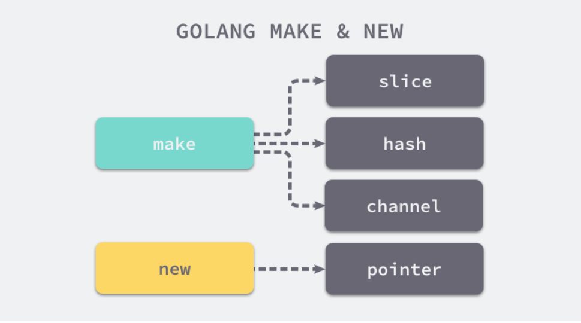

## make 和 new

在golang的语法中，初始化一个结构时，可以使用make和new关键字

+ make的作用时初始化内置的数据结构，也就是切片、map、channel；
+ new的作用时根据传入的类型分配一片内存空间并返回指向这片内存空间的指针；

```
slice := make([]int, 0, 100)
hash := make(map[int]string, 50)
ch := make(chan int, 10)
```

slice是一个包含data,len,cap的私有结构体

hash是一个指向runtime.hmap结构体的指针

ch是一个指向runtime.hchan结构体的指针



