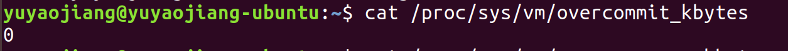
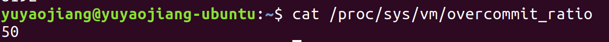
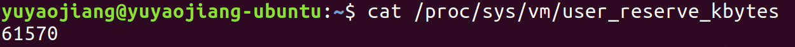
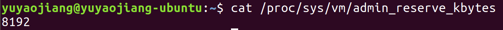

# 内存管理

## linux OOM机制

linux下有一种OOM-killer机制，它会在系统内存耗尽时，启动算法选择性的杀掉一些进程

### 内核管理之overcommit特性

/proc/sys/vm/overcommit_memory参数
在Linux中当malloc返回的是非空时，并不代表有可以使用的内存空间。Linux系统允许程序申请比系统可用内存更多的内存空间，这个特性叫做 overcommit 特性，这样做可能是为了系统的优化。**/proc/sys/vm/overcommit_memory** 这个参数用来控制内核对overcommit_memory的策略，参数可以设定的值为：

```
#define OVERCOMMIT_GUESS   0
#define OVERCOMMIT_ALWAYS  1
#define OVERCOMMIT_NEVER   2
```

+ **OVERCOMMIT_ALWAYS**表示内核并不限制overcommit，无论进程们commit了多少的地址空间的申请，都允许通过；
+ **OVERCOMMIT_NEVER**是另外的极端，永远不要overcommit；
+ **OVERCOMMIT_GUESS**的策略和其名字一样，就是“你猜”，其实是根据一定的策略计算；

### 内核参数ovrecommit_bytes和overcommit_ratio

OVERCOMMIT_NEVER不行，这种策略下，系统不允许出现overcommit。不过要检查overcommit，具体如何判断呢，总得有个标准吧，这个标准可以从vm_commit_limit这个函数看出:

```
/*
 * Committed memory limit enforced when OVERCOMMIT_NEVER policy is used
 */
unsigned long vm_commit_limit(void)
{
    unsigned long allowed;

    if (sysctl_overcommit_kbytes)
        allowed = sysctl_overcommit_kbytes >> (PAGE_SHIFT - 10);
    else
        allowed = ((totalram_pages() - hugetlb_total_pages())
               * sysctl_overcommit_ratio / 100);
    allowed += total_swap_pages;

    return allowed;
}
```

根据以上代码分析，overcommit的值的计算存在两种情况：
+ sysctl_overcommit_kbytes不为0时：allowed = sysctl_overcommit_kbytes + total_swap_pages;
+ sysctl_overcommit_kbytes为0时：allowed = (totalram_pages()-hugetlb_total_pages())* sysctl_overcommit_ratio/100 + total_swap_pages;

**total_swap_pages**:就是系统可以将anonymous page交换到磁盘的大小，如果我们建立32MB的swap file或者swap device，那么total_swap_pages就是（32M/page size）

**totalram_pages**:系统可以管理分配的总内存数目

**hugetlb_total_pages**:巨型页占用的内存数

**overcommit_kbytes**:系统默认值(ubuntu18.04-kernel4.15)为：0



**overcommit_ratio**:系统默认值(ubuntu18.04-kernel4.15)为：50



### 内核参数之admin_reserve_kbytes和user_reserve_kbytes

两个参数就是防止内存管理模块把自己逼到绝境，用户当然想恢复，例如kill那个吞噬大量内存的进程。这个操作也需要内存（需要fork进程），因此，为了能够让用户顺利逃脱绝境，系统会保留**user_reserve_kbytes**的内存，默认值：61570



对于支持多用户的GNU/linux系统而言，恢复系统可能需要root用来来完成，这时候需要保留一定的内存来支持root用户的登录操作，支持root进行trouble shooting（使用ps，top等命令），找到那个闹事的进程并kill掉它。这些为root用户操作而保留的memory定义在**admin_reserve_kbytes**参数中，默认值：8192



## 如何保护一个进程不被OOM killer杀掉

### 内核参数之oom_*

```
/proc/<pid>/oom_adj
/proc/<pid>/oom_score_adj
/porc/<pdi>/oom_score
```
#### oom_score_adj

该文件描述如下：

```
The value of /proc/<pid>/oom_score_adj is added to the badness score before it is used to determine 
which task to kill.  Acceptable values range from -1000 (OOM_SCORE_ADJ_MIN) to +1000 (OOM_SCORE_ADJ_MAX).
This allows userspace to polarize the preference for oom killing either by always preferring a certain 
task or completely disabling it.  The lowest possible value, -1000, is equivalent to disabling oom killing 
entirely for that task since it will always report a badness score of 0.
```

在计算最终的 badness score 时，会在计算结果是中加上 oom_score_adj ,这样用户就可以通过该在值来保护某个进程不被杀死或者每次都杀某个进程。其取值范围为-1000到1000 。

如果将**该值设置为-1000，则进程永远不会被杀死**，因为此时 badness score 永远返回0。

#### oom_adj

该文件描述如下：

```
The value of /proc/<pid>/oom_score_adj is added to the badness score before it

For backwards compatibility with previous kernels, /proc/<pid>/oom_adj may also be used to tune the badness score.
Its acceptable values range from -16 (OOM_ADJUST_MIN) to +15 (OOM_ADJUST_MAX) and a special value of -17(OOM_DISABLE)
to disable oom killing entirely for that task.  Its value is scaled linearly with /proc/<pid>/oom_score_adj.
```

该设置参数的存在是为了和旧版本的内核兼容。其设置范围为-17到15。**-17表示进程永远不会被杀死**

内核使用以上两个接口时，如果更改其中一个，另一个会自动跟着变化。

内核的实现方式为：

+ 写oom_score_adj时，内核里都记录在变量 task->signal->oom_score_adj 中；
+ 读oom_score_adj时，从内核的变量 task->signal->oom_score_adj 中读取；
+ 写oom_adj时，也是记录到变量 task->signal->oom_score_adj 中，会根据oom_adj值按比例换算成oom_score_adj。
+ 读oom_adj时，也是从内核变量 task->signal->oom_score_adj 中读取，只不过显示时又按比例换成oom_adj的范围。

#### oom_score

该文件的描述如下:

```
This file can be used to check the current score used by the oom-killer is for any given <pid>. Use it together with
/proc/<pid>/oom_score_adj to tune which process should be killed in an out-of-memory situation.
```

OOM killer机制主要根据该值和 /proc/<pid>/oom_score_adj 来决定杀死哪一个进程的。

**注意**：当选择杀死一个父进程时，oom killer会尝试着杀死该父进程的第一个子进程（具有独立的地址空间的子进程），而不是直接杀死这个父进程。这样就避免了杀死一些重要的系统守护进程


## 参考文献：

[内核内存管理](https://learning-kernel.readthedocs.io/en/latest/mem-management.html#linux-oom)