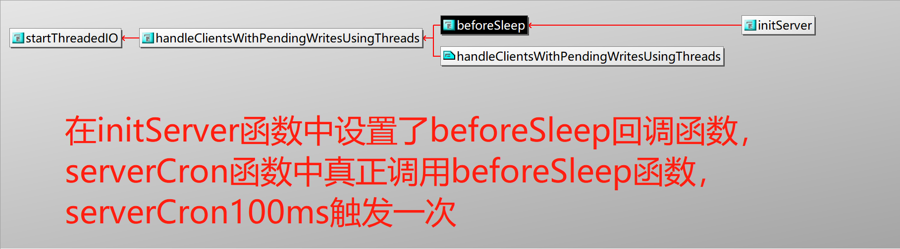
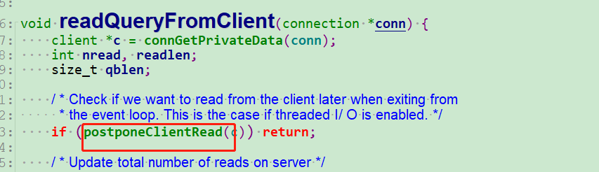
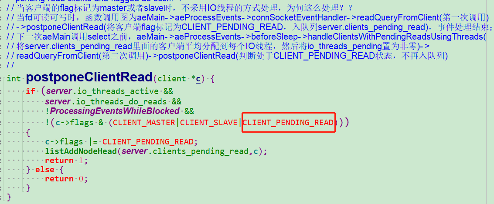

# redis多线程IO分析

+ 用一组单独的线程专门进行 read/write socket读写调用 （同步IO）
+ 读回调函数中不再读数据，而是将对应的连接追加到可读clients_pending_read的链表
+ 主线程在beforeSleep中将IO读任务分给IO线程组
+ 主线程自己也处理一个IO读任务，并自旋式等IO线程组处理完，再继续往下
+ 主线程在beforeSleep中将IO写任务分给IO线程组
+ 主线程自己也处理一个IO写任务，并自旋式等IO线程组处理完，再继续往下
+ IO线程组要么同时在读，要么同时在写
+ 命令的执行由主线程串行执行(保持单线程)
+ IO线程数量可配置

其具体流程如下图：


+ initThreadedIO函数分析：
函数调用栈为：main->InitServerLast->initThreadedIO


```
/* Initialize the data structures needed for threaded I/O. */
void initThreadedIO(void) {
    server.io_threads_active = 0; /* We start with threads not active. */

    /* Don't spawn any thread if the user selected a single thread:
     * we'll handle I/O directly from the main thread. */
    if (server.io_threads_num == 1) return;

    if (server.io_threads_num > IO_THREADS_MAX_NUM) {
        serverLog(LL_WARNING,"Fatal: too many I/O threads configured. "
                             "The maximum number is %d.", IO_THREADS_MAX_NUM);
        exit(1);
    }

    /* Spawn and initialize the I/O threads. */
    for (int i = 0; i < server.io_threads_num; i++) {
        /* Things we do for all the threads including the main thread. */
        io_threads_list[i] = listCreate();
        //这里将主线程跳过
        if (i == 0) continue; /* Thread 0 is the main thread. */

        /* Things we do only for the additional threads. */
        pthread_t tid;
        pthread_mutex_init(&io_threads_mutex[i],NULL);
        io_threads_pending[i] = 0;
        //创建IO线程的时候，主线程获取了其他IO线程的互斥量：io_threads_mutex，
        //这样其他线程启动的时候卡在pthread_mutex_lock
        pthread_mutex_lock(&io_threads_mutex[i]); /* Thread will be stopped. */
        if (pthread_create(&tid,NULL,IOThreadMain,(void*)(long)i) != 0) {
            serverLog(LL_WARNING,"Fatal: Can't initialize IO thread.");
            exit(1);
        }
        io_threads[i] = tid;
    }
}

```

initThreadedIO只是创建了IO线程，此时，所有的IO线程卡在获取互斥量的函数调用中


+ IOThreadMain函数分析：该函数时IO线程的入口函数

```
void *IOThreadMain(void *myid) {
    /* The ID is the thread number (from 0 to server.iothreads_num-1), and is
     * used by the thread to just manipulate a single sub-array of clients. */
    long id = (unsigned long)myid;
    char thdname[16];

    snprintf(thdname, sizeof(thdname), "io_thd_%ld", id);
    redis_set_thread_title(thdname);
    redisSetCpuAffinity(server.server_cpulist);
    makeThreadKillable();

    while(1) {
        /* Wait for start */
        //主线程将客户端分配到io_threads_list之后，会将io_threads_pending置为链表的长度(客户端个数)
        //此时for循环break，IO线程开始处理io_threads_list链表中客户端的读写操作
        for (int j = 0; j < 1000000; j++) {
            if (io_threads_pending[id] != 0) break;
        }

        /* Give the main thread a chance to stop this thread. */
        if (io_threads_pending[id] == 0) {
            //刚启动线程的时候，由于主线程得到了锁，IO线程都卡在这里
            pthread_mutex_lock(&io_threads_mutex[id]);
            pthread_mutex_unlock(&io_threads_mutex[id]);
            continue;
        }

        serverAssert(io_threads_pending[id] != 0);

        if (tio_debug) printf("[%ld] %d to handle\n", id, (int)listLength(io_threads_list[id]));

        /* Process: note that the main thread will never touch our list
         * before we drop the pending count to 0. */
        listIter li;
        listNode *ln;
        listRewind(io_threads_list[id],&li);
        while((ln = listNext(&li))) {
            client *c = listNodeValue(ln);
            if (io_threads_op == IO_THREADS_OP_WRITE) {
                writeToClient(c,0);
            } else if (io_threads_op == IO_THREADS_OP_READ) {
                readQueryFromClient(c->conn);
            } else {
                serverPanic("io_threads_op value is unknown");
            }
        }
        //IO操作完成，清空链表，将io_threads_pending回置为零，准备下一轮的IO操作
        listEmpty(io_threads_list[id]);
        io_threads_pending[id] = 0;

        if (tio_debug) printf("[%ld] Done\n", id);
    }
}

```

IO线程什么时候开始读写呢？？



```
void startThreadedIO(void) {
    if (tio_debug) { printf("S"); fflush(stdout); }
    if (tio_debug) printf("--- STARTING THREADED IO ---\n");
    serverAssert(server.io_threads_active == 0);
    //主线程释放互斥量，之后IO线程取到锁，开始执行IO操作，将io_threads_active置为1
    for (int j = 1; j < server.io_threads_num; j++)
        pthread_mutex_unlock(&io_threads_mutex[j]);
    server.io_threads_active = 1;
}
```

这里还提供了一个关闭IO线程的读写操作接口

```
void stopThreadedIO(void) {
    /* We may have still clients with pending reads when this function
     * is called: handle them before stopping the threads. */
    /* 在停止IO线程之前，可能存在已经放到pending队列的客户端，此时完成相应的调度 */
    handleClientsWithPendingReadsUsingThreads();
    if (tio_debug) { printf("E"); fflush(stdout); }
    if (tio_debug) printf("--- STOPPING THREADED IO [R%d] [W%d] ---\n",
        (int) listLength(server.clients_pending_read),
        (int) listLength(server.clients_pending_write));
    serverAssert(server.io_threads_active == 1);
    for (int j = 1; j < server.io_threads_num; j++)
        //这里获取in_threads_mutex互斥量，那么IO线程就会被阻塞在pthread_mutex_lock调用中
        pthread_mutex_lock(&io_threads_mutex[j]);
    server.io_threads_active = 0;
}
```
因为在之前的IO线程的主函数中，IO线程没有一直持有锁，而是在获得锁之后立马释放了


当主线程调用stopThreadedIO函数的时候，IO线程就被阻塞在pthread_mutex_lock中了，也就关闭了IO线程的读写，挂起

什么时候回去关闭IO线程的读写操作呢？？


分析完IO线程的读写打开和关闭，下面来看IO线程如何处理IO:

前面已经分析，在IOThreadMain函数总，IO线程根据io_threads_pending原子变量是否非零来判断是否有读写任务，io_threads_pending变量不为0时，进入到遍历链表的代码段中：


读函数readQueryFromClient会调用postponeClientRead接口






