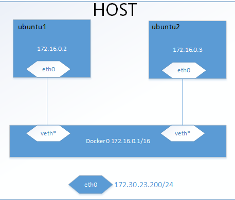
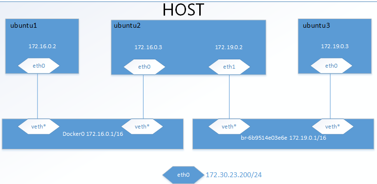

# docker学习总结

## docker网络配置

### host模式：

使用场景：docker与宿主机之间需要通信

step1:ubuntu宿主机操作

```bash
  #docker run -it --name ubuntu --network="host" ubuntu:18.04
```
step2: docker-ubuntu操作

```bash

  #apt-get update
  #apt-get install iputils-ping
  #apt-get install net-tools
  #ping 172.30.23.170

  #ifconfig
```

step3:查看host网络信息

```bash
  #docker network inspect host
```

结果为：

```
  [
      {
          "Name": "host",
          "Id": "9e2611e38b7aafd875a7984885aece62f1a56eaa2cce174cff2ffbc340a57571",
          "Created": "2019-02-25T11:19:15.29750653+08:00",
          "Scope": "local",
          "Driver": "host",
          "EnableIPv6": false,
          "IPAM": {
              "Driver": "default",
              "Options": null,
              "Config": []
          },
          "Internal": false,
          "Attachable": false,
          "Ingress": false,
          "ConfigFrom": {
              "Network": ""
          },
          "ConfigOnly": false,
          "Containers": {
              "5b7af352fa76da041397b04937dc9b08a28d80b372ebff7db93cc6ad1cdae3fa": {
                  "Name": "ubuntu",
                  "EndpointID": "fcc1c40dabffbc59c55bdef128283d5a1fc171b8eb79e66324f1522803f3fa29",
                  "MacAddress": "",
                  "IPv4Address": "",
                  "IPv6Address": ""
              }
          },
          "Options": {},
          "Labels": {}
      }
  ]
```

### bridge模式

使用场景：同一台主机内的多个docker需要相互通信

在默认的bridge网络中，docker不支持主机名自动探索；如果你想通过容器名称相互访问，那么必须使用 docker run --link 选项启动容器

网络拓扑图：



配置操作：

step1:
```bash
  #docker run -itd --name ubuntu1 --network="bridge" ubuntu:18.04
  #docker run -itd --name ubuntu2 --network="bridge" ubuntu:18.04
```

step2:
```bash
  #docker container ls
  #docker exec -it bash id
```

step3:
```bash
  #apt-get install
  #apt-get install iputils-ping
  #apt-get install net-tools
  #ifconfig
```

step4:
```bash
  #docker network inspect bridge
```

结果：

```
  [
      {
          "Name": "bridge",
          "Id": "9979fa26cd6ff11e66ec3efdb38589f205334bf8703d93ee6eeacb9d72dfb44c",
          "Created": "2019-05-16T09:36:31.493577872+08:00",
          "Scope": "local",
          "Driver": "bridge",
          "EnableIPv6": false,
          "IPAM": {
              "Driver": "default",
              "Options": null,
              "Config": [
                  {
                      "Subnet": "172.17.0.0/16",
                      "Gateway": "172.17.0.1"
                  }
              ]
          },
          "Internal": false,
          "Attachable": false,
          "Ingress": false,
          "ConfigFrom": {
              "Network": ""
          },
          "ConfigOnly": false,
          "Containers": {
              "87ddbad6f7e3a4cb7e1e30205a223973fd34fe56d0716f70a4137119de0f0b30": {
                  "Name": "ubuntu1",
                  "EndpointID": "8795f8592b2a3705ba18e268f20bcccbc34c22a829390c769d0dbf213e528007",
                  "MacAddress": "02:42:ac:11:00:02",
                  "IPv4Address": "172.17.0.2/16",
                  "IPv6Address": ""
              },
              "d060fb6fd4b4828ef65558f7b964a6cd3f9994123083941f9d4d0e1c182ca026": {
                  "Name": "ubuntu2",
                  "EndpointID": "00c24b7d3f3f773dabcde247e379f33e11b482f4e60b4c3c0f040e04b8cd9818",
                  "MacAddress": "02:42:ac:11:00:03",
                  "IPv4Address": "172.17.0.3/16",
                  "IPv6Address": ""
              }
          },
          "Options": {
              "com.docker.network.bridge.default_bridge": "true",
              "com.docker.network.bridge.enable_icc": "true",
              "com.docker.network.bridge.enable_ip_masquerade": "true",
              "com.docker.network.bridge.host_binding_ipv4": "0.0.0.0",
              "com.docker.network.bridge.name": "docker0",
              "com.docker.network.driver.mtu": "1500"
          },
          "Labels": {}
      }
  ]
```

### overlay模式

使用场景：不同主机内的多个docker需要相互通信

### macvlan模式

使用场景：docker表现为一个主机模式，每个docker有各自单独的mac地址
```bash
  #docker network create -d macvlan --subnet 172.19.0.0/24 --gateway 172.19.0.1 -o parent=enp0s3 mvnet
  #docker run -itd --name busybox1 --network="mvnet" busybox:glibc
  #docker run -itd --name busybox2 --network="mvnet" busybox:glibc
```

查看mvnet信息:
```bash
  #docker network inspect mvnet
```
显示结果：
```
  [
      {
          "Name": "mvnet",
          "Id": "942c65a559eb4f91092790233bd98a0f1b03c1b3a9b05cbbbaab2b33cb3a7426",
          "Created": "2019-05-22T17:51:47.042280641+08:00",
          "Scope": "local",
          "Driver": "macvlan",
          "EnableIPv6": false,
          "IPAM": {
              "Driver": "default",
              "Options": {},
              "Config": [
                  {
                      "Subnet": "172.19.0.0/24",
                      "Gateway": "172.19.0.1"
                  }
              ]
          },
          "Internal": false,
          "Attachable": false,
          "Ingress": false,
          "ConfigFrom": {
              "Network": ""
          },
          "ConfigOnly": false,
          "Containers": {
              "2bcb6db58950c952b6a7ca2bc99fa66ff4f02204fd74640692491b387bac3e81": {
                  "Name": "busybox2",
                  "EndpointID": "d93d0cdabeda9ed9cc0b4bb14c18481a3ba84cfb3efdea6f46f46b2155cefae8",
                  "MacAddress": "02:42:ac:13:00:03",
                  "IPv4Address": "172.19.0.3/24",
                  "IPv6Address": ""
              },
              "3d2d8ac4d1b73fab7832643769d13d140794d475a8763a7ff956858c3a274c87": {
                  "Name": "busybox1",
                  "EndpointID": "38eb0b71617032a71decf7ef3bb1febc7fa6b7703354fa73f026d8b6d6aae545",
                  "MacAddress": "02:42:ac:13:00:02",
                  "IPv4Address": "172.19.0.2/24",
                "IPv6Address": ""
              }
          },
          "Options": {
              "parent": "enp0s3"
          },
          "Labels": {}
      }
  ]
```

进入busybox1执行ping操作，ping busybox2和host，busybox2成功，host失败。容器并不能ping同网关、物理网卡地址
和外网地址，这是macvlan自身安全性和隔离性的体现，并不是docker容器的原因

```
  #docker exec -it box1_id sh
  / # ping 172.19.0.3
  PING 172.19.0.3 (172.19.0.3): 56 data bytes
  64 bytes from 172.19.0.3: seq=0 ttl=64 time=0.124 ms
  64 bytes from 172.19.0.3: seq=1 ttl=64 time=0.124 ms
  64 bytes from 172.19.0.3: seq=2 ttl=64 time=0.125 ms
  64 bytes from 172.19.0.3: seq=3 ttl=64 time=0.117 ms
  64 bytes from 172.19.0.3: seq=4 ttl=64 time=0.083 ms
  64 bytes from 172.19.0.3: seq=5 ttl=64 time=0.085 ms
  64 bytes from 172.19.0.3: seq=6 ttl=64 time=0.051 ms

  / # ping -w 4 172.30.23.200
  PING 172.30.23.200 (172.30.23.200): 56 data bytes
 
  --- 172.30.23.200 ping statistics ---
  5 packets transmitted, 0 packets received, 100% packet loss
```

macvlan参考文献1：[Docker Macvlan](https://www.cnblogs.com/bigberg/p/8656963.html)

macvlan参考文献2：[Networking using a macvlan network](https://docs.docker.com/network/network-tutorial-macvlan/)。

### third-party：第三方网络驱动

#### 创建两个bridge

网络拓扑图：



操作步骤：

step1:
```bash
  #docker network create --driver bridge test_net
  #docker run -itd --name ubuntu1 --network="bridge" ubuntu:18.04
  #docker run -itd --name ubuntu2 --network="bridge" ubuntu:18.04
  #docker run -itd --name ubuntu3 --network="test_net" ubuntu:18.04
  #docker network connect test_net ubuntu2
  #docker container ls
  #docker exec -it ubuntu2_id /bin/bash
  #apt-get update
  #apt-get install iputils-ping
  #apt-get install net-tools
  #ifconfig
  #ping 172.16.0.2

  #ping 172.19.0.3

  #exit

  #docker exec -it ubuntu1_id /bin/bash
  #ifconfig
  #ping 172.16.0.3

  #ping 172.19.0.3

  #exit

  #docker network inspect test_net
  #docker network inspect bridge
```

docker1和docker2可以相互通信，docker2和docker3可以相互通信，docker1和docker3相互隔离，

### 将Docker容器配置到本地网络环境中

操作步骤：

```bash
  #docker run -itd --name busybox1 --rm --net=none busybox:glibc
  #pipework br0 busybox1 172.30.23.100/24@172.30.23.1
  #ip addr add 172.30.23.200/24 dev br0
  #ip addr del 172.30.23.200/24 dev enp0s3
  #brctl addif br0 enp0s3
  #ip route del default
  #ip route add default via 172.30.23.1 dev br0
```

这种配置方式docker，宿主机，PC机，处于同一网段的其他PC机可以相互通信
备注：这里有一个限制，由于docker的ip是手动配置的静态ip，公司网关限制静态ip无法连接大网，因此，实验中的其他PC和本机PC需要通过一个交换机连接起来，绕过公司的网关

虚拟机配置修改：

If you use VirtualBox, you will have to update your VM network settings. 
Open the settings panel for the VM, go the the "Network" tab, pull down the "Advanced" settings. 
Here, the "Adapter Type" should be pcnet (the full name is something like "PCnet-FAST III"), 
instead of the default e1000 (Intel PRO/1000). Also, "Promiscuous Mode" should be set to "Allow All".

参看：[](https://github.com/jpetazzo/pipework/blob/master/README.md#virtualbox)

### 容器之间使用domain socket进行通信的配置步骤

step1: 创建文件夹并修改权限，供redis-server 和 redis-cli 使用

```bash
  #mkdir /tmp/redis
  #chmod 777 /tmp/redis
```

step2: 创建 redis-server 容器

```bash
  #docker pull redis:v4.0
  #docker run -it -v /tmp/redis/:/tmp/redis/ --rm --name myredis redis:4.0 redis-server /tmp/redis/redis.conf
```

step3: 创建 redis-cli 容器

```bash
  #docker pull goodsmileduck/redis-cli:v4.0.12
  #docker run --name redis-cli -it --rm -v /tmp/redis/:/tmp/redis/ goodsmileduck/redis-cli:v4.0.12 redis-cli -s /tmp/redis/redis.sock
```

之后就可以操作redis-server了
