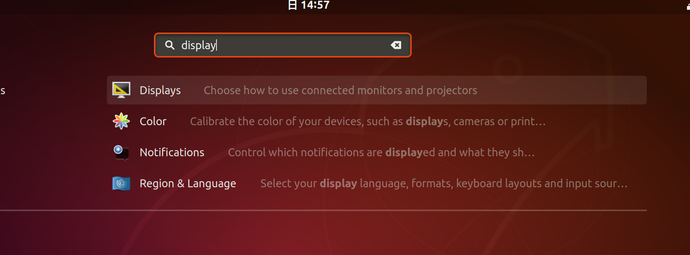
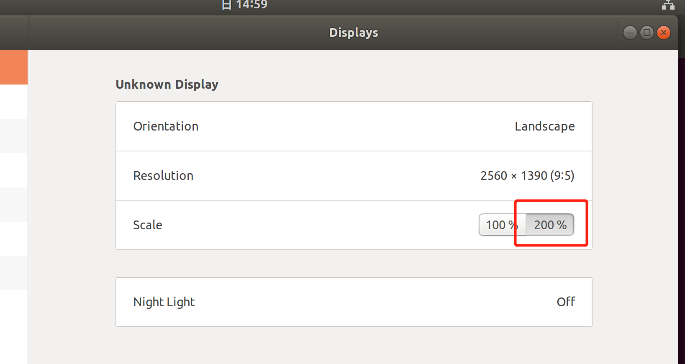

# virtual-box安装ubuntu18.04 问题汇总
## 屏幕小的问题
环境版本：

virtual-box 6.0.24

ubuntu 18.04

解决方案：

1、安装增强功能 设备->安装增强功能

2、apt install virtulbox-guest-additions-iso

3、cd /media/yuyaojiang/VBox_GAs_6.0.24 && ./VBoxLinuxAdditions.run

4、reboot


## ubuntu屏幕字体小
解决办法：
在show application里面搜索display，将scale调整为200%





## 共享文件夹无权限访问
解决办法：将用户加入到vboxsf组里
```
sudo usermod -a -G vboxsf yuyaojiang
reboot
```
