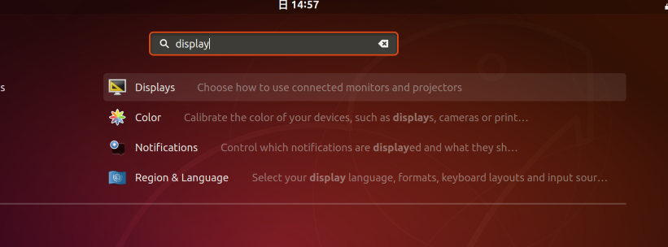
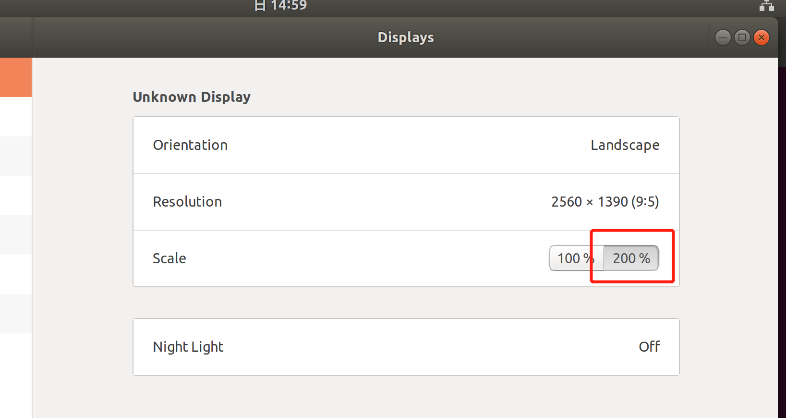
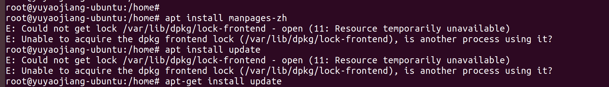
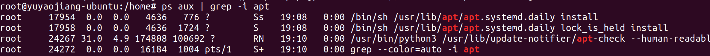

# virtual-box安装ubuntu18.04 问题汇总

## 屏幕小的问题
环境版本：

virtual-box 6.0.24

ubuntu 18.04

解决方案：

1、安装增强功能 设备->安装增强功能

2、apt install virtulbox-guest-additions-iso

3、cd /media/yuyaojiang/VBox_GAs_6.0.24 && ./VBoxLinuxAdditions.run

4、reboot


## ubuntu屏幕字体小
解决办法：
在show application里面搜索display，将scale调整为200%





## 共享文件夹无权限访问
解决办法：将用户加入到vboxsf组里
```
sudo usermod -a -G vboxsf yuyaojiang
reboot
```
## 普通用户无法使用docker命令
解决办法：将用户加入到docker组里
```
sudo usermod -a -G docker yuyaojiang
reboot
```

## apt install xxx

当apt install xxx出现下图错误时：



E: Could not get lock /var/lib/dpkg/lock – open (11: Resource temporarily unavailable)

E: Unable to lock the administration directory (/var/lib/dpkg/), is another process using it?

解决办法：

1、查看使用apt命令的进程：
```
ps aux | grep -i apt
```
产生如下输出：



表示当前有进程在使用apt程序，可以等一会在使用该命令，原因时ubuntu18.04版本会每天定时更新和安全有关的deb包


